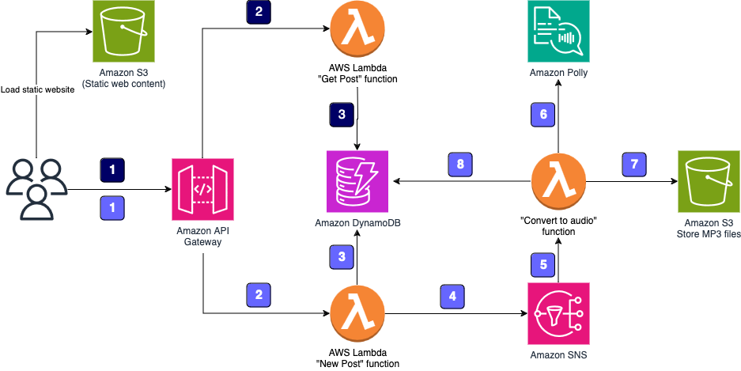

+++
title = "Workshop Outline"
date = 2024
weight = 1
chapter = false
pre = "<b>1. </b>"
+++

## Objectives

After completing this workshop, you will be able to:

- Create an Amazon DynamoDB table for data storage
- Create a RESTful API with Amazon API Gateway
- Create AWS Lambda functions triggered by API Gateway
- Connect AWS Lambda functions with Amazon Simple Notification Service (SNS)
- Use Amazon Polly to synthesize speech in multiple languages and voices

## Duration

This workshop takes approximately 90 minutes to complete.

## Workshop Environment

You will build a serverless application, meaning you don't need to work with servers - no provisioning, patching, or scaling. AWS Cloud will automatically handle these tasks, allowing you to focus on your application.

The application provides two methods:
1. Send information about new posts to convert into MP3 files
2. Retrieve information about posts (including links to MP3 files stored in Amazon S3 bucket)

Both methods are exposed as RESTful web services through Amazon API Gateway.

## When the application sends information about new posts:

1. The information is received by the RESTful web service exposed by Amazon API Gateway. This web service is invoked by a static webpage hosted on Amazon Simple Storage Service (Amazon S3).

2. Amazon API Gateway triggers an AWS Lambda function, "New Post", which is responsible for initializing the process of generating MP3 files.

3. The Lambda function inserts information about the post into an Amazon DynamoDB table, where information about all posts is stored.

4. To run the whole process asynchronously, Amazon Simple Notification Service (Amazon SNS) is used to decouple the process of receiving information about new posts and starting their audio conversion.

5. Another Lambda function, "Convert to Audio", is subscribed to your SNS topic and is triggered whenever a new message appears (which means that a new post should be converted into an audio file).

6. The "Convert to Audio" Lambda function uses Amazon Polly to convert the text into an audio file in the specified language (the same as the language of the text).

7. The new MP3 file is saved in a dedicated S3 bucket.

8. Information about the post is updated in the DynamoDB table. The URL to the audio file stored in the S3 bucket is saved with the previously stored data.

## When the application retrieves information about posts:

1. The RESTful web service is deployed using Amazon API Gateway. Amazon API Gateway exposes the method for retrieving information about posts. These methods contain the text of the post and the link to the S3 bucket where the MP3 file is stored. The web service is invoked by a static webpage hosted on Amazon S3.

2. Amazon API Gateway invokes the "Get Post" Lambda function, which deploys the logic for retrieving the post data.

3. The "Get Post" Lambda function retrieves information about the post (including the reference to Amazon S3) from the DynamoDB table and returns the information.