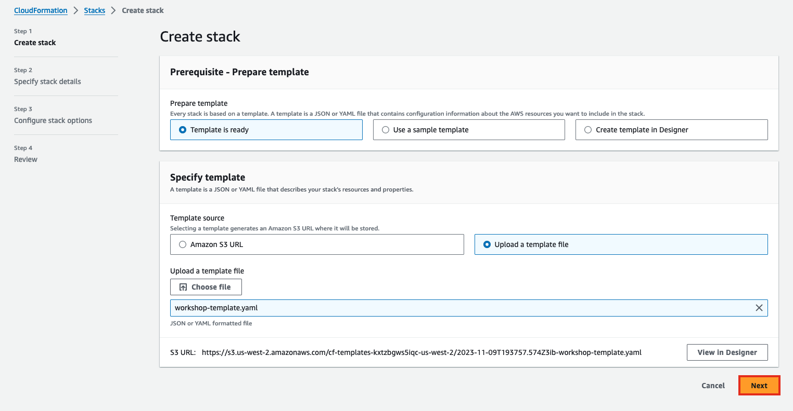

+++
title = "Environment Setup"
date = 2021
weight = 2
chapter = false
pre = "<b>2. </b>"
+++

## Important Note
> If you are attending an AWS-hosted event, you may skip this section.

If you have administrative access to the AWS Management Console, you can use your AWS account to begin this workshop.

## Launching a CloudFormation Stack

We'll use an AWS CloudFormation template to set up the necessary lab resources in your chosen AWS Region. This step is crucial as subsequent instructions rely on these resources. The CloudFormation template will provision the following:

- IAM Role
- Amazon DynamoDB table
- AWS Step Functions State Machine

### Steps to Launch:

1. **Download the CloudFormation template**: [Download Here](https://static.us-east-1.prod.workshops.aws/public/2b2654d0-25fc-498c-9d95-069507fc0346/static/template/workshop-stack.yaml)

2. Save the YAML template file in a folder on your local machine.

3. Open the [AWS CloudFormation Console](https://console.aws.amazon.com/cloudformation/).

4. In the CloudFormation console, select "Upload a template file".

5. Choose the template you just downloaded, then click "Next".

6. Give the stack a name, such as `polly-serverless-stack`.

7. For Configure stack options, keep the default values and choose Next.

8. In Capabilities and transforms, acknowledge all options.

9. To deploy the template, choose Submit.

10. After the template is deployed, to review the created resources, navigate to CloudFormation Resources, and then select the CloudFormation stack that you created.

Note: CloudFormation deployment typically takes 1-2 minutes to complete.