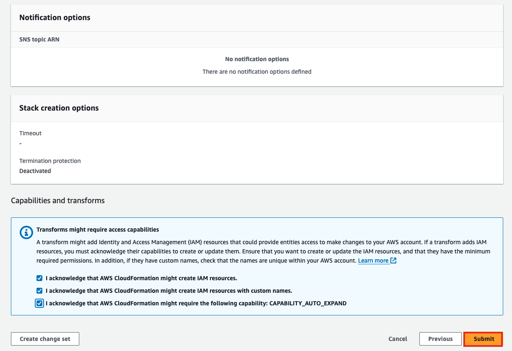

+++
title = "Thiết lập Môi trường"
date = 2021
weight = 2
chapter = false
pre = "<b>2. </b>"
+++

## Lưu ý Quan trọng
> Nếu bạn đang tham dự một sự kiện do AWS tổ chức, bạn có thể bỏ qua phần này.

Nếu bạn có quyền truy cập quản trị vào AWS Management Console, bạn có thể sử dụng tài khoản AWS của mình để bắt đầu hội thảo này.

## Khởi chạy một CloudFormation Stack

Chúng ta sẽ sử dụng một mẫu AWS CloudFormation để thiết lập các tài nguyên cần thiết cho phòng thí nghiệm trong Khu vực AWS mà bạn chọn. Bước này rất quan trọng vì các hướng dẫn tiếp theo phụ thuộc vào các tài nguyên này. Mẫu CloudFormation sẽ cung cấp các tài nguyên sau:

- IAM Role
- Bảng Amazon DynamoDB
- AWS Step Functions State Machine

### Các bước để Khởi chạy:

1. **Tải xuống mẫu CloudFormation**: [Tải xuống tại đây](https://static.us-east-1.prod.workshops.aws/public/2b2654d0-25fc-498c-9d95-069507fc0346/static/template/workshop-stack.yaml)

2. Lưu tệp mẫu YAML vào một thư mục trên máy tính của bạn.

3. Mở [AWS CloudFormation Console](https://console.aws.amazon.com/cloudformation/).

4. Trong bảng điều khiển CloudFormation, chọn "Tải lên một tệp mẫu".

5. Chọn mẫu bạn vừa tải xuống, sau đó nhấp vào "Tiếp theo".

1. Đặt tên cho stack, chẳng hạn như `polly-serverless-stack`.

2. Đối với Cấu hình tùy chọn stack, giữ các giá trị mặc định và chọn Tiếp theo.

3. Trong phần Khả năng và biến đổi, xác nhận tất cả các tùy chọn.

1. Để triển khai mẫu, chọn Gửi.

2.  Sau khi mẫu được triển khai, để xem lại các tài nguyên đã tạo, điều hướng đến Tài nguyên CloudFormation, và sau đó chọn stack CloudFormation mà bạn đã tạo.

Lưu ý: Việc triển khai CloudFormation thường mất 1-2 phút để hoàn thành.
