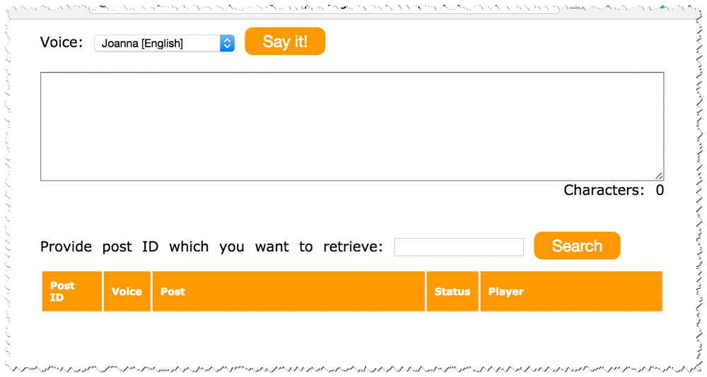
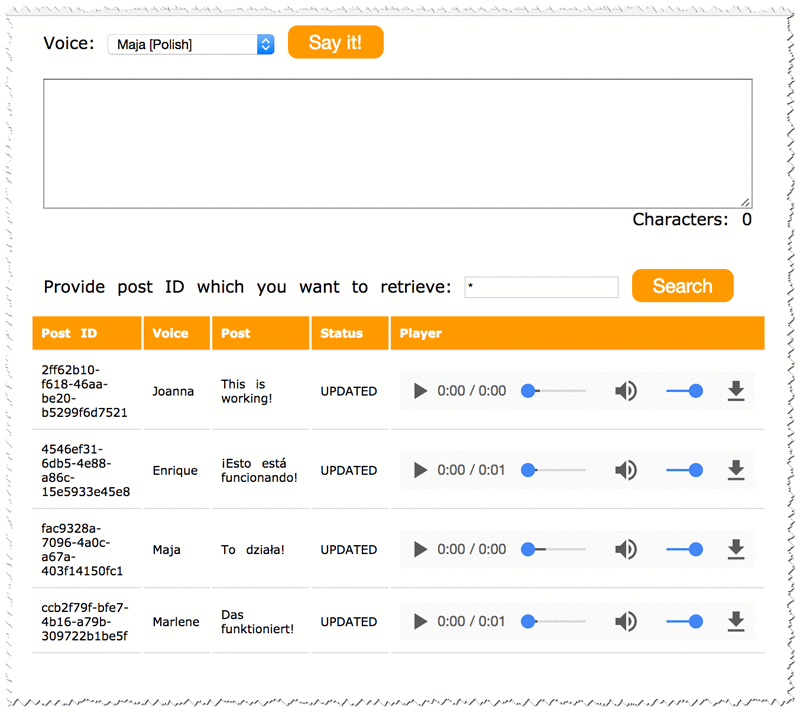

+++
title = "Create a Serverless User Interface"
date = 2023
weight = 9
chapter = false
pre = "<b>3.9 </b>"
+++

## Task 9: Create a Serverless User Interface

Although the application is fully operational, it is only exposed as a RESTful web service. You now deploy a small web page on Amazon S3, which is a great choice for hosting static web pages. This web page uses JavaScript to connect to the API and provide text-to-speech functionalities in a web page.

1. Download these files to your computer, use mouse right click and "Save Link As...".

   - [`index.html`](https://static.us-east-1.prod.workshops.aws/public/2b2654d0-25fc-498c-9d95-069507fc0346/static/scripts/index.html)
   - [`scripts.js`](https://static.us-east-1.prod.workshops.aws/public/2b2654d0-25fc-498c-9d95-069507fc0346/static/scripts/scripts.js)
   - [`styles.css`](https://static.us-east-1.prod.workshops.aws/public/2b2654d0-25fc-498c-9d95-069507fc0346/static/scripts/styles.css)

   **Note:** Ensure that each file keeps the same filename, including the extension.

2. Edit your `scripts.js` file with a Text Editor, replacing `YOUR_API_GATEWAY_ENDPOINT` (on the first line) with the Invoke URL you copied earlier.

   Expected output:

   ```javascript
   var API_ENDPOINT = "https://xxxxx.execute-api.us-west-2.amazonaws.com/Dev"
   ```

3. You now upload these files to an Amazon S3 bucket.

   - At the top of the AWS Management Console, in the search bar, search for and choose S3.
   - Choose **Create bucket** and configure the following details:
     - **Bucket name:** `www-BUCKET`
       - Replace `BUCKET` with the name of your audioposts bucket
     - Copy the name of your bucket to your text editor. You use the bucket name later.
     - You change the bucket's permissions so that the website is accessible to everybody.
       - Under **Object Ownership**, choose **ACLs enabled**
       - Under **Block Public Access settings for this bucket** deselect the **Block all public access** option, and then leave all other options deselected.

   **Note:** Notice all of the individual options remain deselected. When deselecting all public access, you must then select the individual options that apply to your situation and security objectives. In a production environment, it is recommended to use the least permissive settings possible.

   A warning box appears saying that: Turning off block all public access might result in this bucket and the objects within becoming public. AWS recommends that you turn on block all public access, unless public access is required for specific and verified use cases such as static website hosting.

   - Select the check box next to **I acknowledge that the current settings might result in this bucket and the objects within becoming public**.
   - Choose **Create bucket**
   - After the bucket has been created, select it from the bucket list and upload the three files to your new www bucket.

   **Note:** The files must be named: `index.html`, `scripts.js` and `styles.css`

4. On the bucket page, select the **Permissions** tab at the top.

   - Scroll down to the **Bucket Policy** section and choose the **Edit** button.
   - Paste this policy into the editor:

     ```json
     {
         "Version": "2012-10-17",
         "Statement": [
             {
                 "Sid": "PublicReadGetObject",
                 "Effect": "Allow",
                 "Principal": "*",
                 "Action": [
                     "s3:GetObject"
                 ],
                 "Resource": [
                     "arn:aws:s3:::www-BUCKET/*"
                 ]
             }
         ]
     }
     ```

   - Replace `www-BUCKET` with the name of your `www-audioposts` bucket.
   - Choose **Save changes**.

   **WARNING:** If you receive an error that Policy has invalid resource, confirm that you have edited the Resource line to match the name of your bucket.

   **Note:** You can ignore the warning that This bucket has public access. This is intentional.

5. Finally, you activate static website hosting, which makes the bucket operate like a static website.

   - Choose the **Properties** tab.
   - Ignore the AWS CloudTrail Permission error.
   - Scroll down to the **Static website hosting** section and choose **Edit**.
   - Choose **Enable** for Static website hosting.
     - **Index document:** `index.html`
     - **Error document:** `index.html`
       - **Note:** For now we are using the `index.html` file as error document.
   - Choose **Save changes**.
   - Copy the Endpoint URL to your clipboard.

   And that's it! You can now check if the website is working.

   - Open a new web browser tab and paste the Endpoint URL that you just copied.
   - You should see a page that looks like this:
   

   - If you write something in the text area and choose **Say it**, the event is sent to your application. The application asynchronously converts the text into an audio file. Depending on the size of the text you provide, it can take a couple of seconds or a couple of minutes to convert it to an audio file.

   - To view the posts and their audio files, type the post ID or `*` in the Search box:
   


   - Play button to hear the audio.

   **Task Complete**

   You can now proceed to next task.