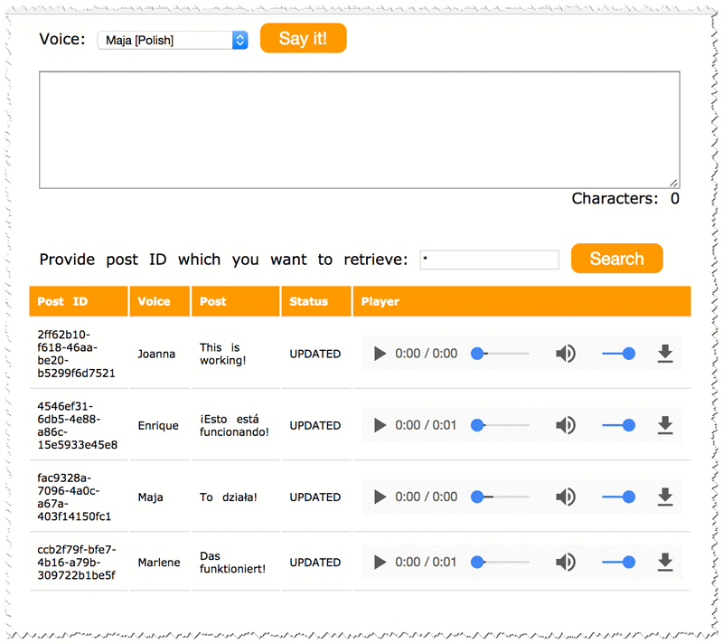

+++
title = "Tạo giao diện người dùng không máy chủ"
date = 2023
weight = 9
chapter = false
pre = "<b>3.9 </b>"
+++

## Nhiệm vụ 9: Tạo giao diện người dùng không máy chủ

Mặc dù ứng dụng đã hoạt động hoàn toàn, nó chỉ được công khai dưới dạng dịch vụ web RESTful. Bây giờ bạn sẽ triển khai một trang web nhỏ trên Amazon S3, đây là một lựa chọn tuyệt vời để lưu trữ các trang web tĩnh. Trang web này sử dụng JavaScript để kết nối với API và cung cấp các chức năng chuyển văn bản thành giọng nói trên một trang web.

1. Tải các tệp này về máy tính của bạn, sử dụng chuột phải và chọn "Save Link As...".

     - [`index.html`](https://static.us-east-1.prod.workshops.aws/public/2b2654d0-25fc-498c-9d95-069507fc0346/static/scripts/index.html)
      - [`scripts.js`](https://static.us-east-1.prod.workshops.aws/public/2b2654d0-25fc-498c-9d95-069507fc0346/static/scripts/scripts.js)
      - [`styles.css`](https://static.us-east-1.prod.workshops.aws/public/2b2654d0-25fc-498c-9d95-069507fc0346/static/scripts/styles.css)

   **Lưu ý:** Đảm bảo rằng mỗi tệp giữ nguyên tên tệp, bao gồm cả phần mở rộng.

2. Chỉnh sửa tệp `scripts.js` của bạn bằng Trình chỉnh sửa văn bản, thay thế `YOUR_API_GATEWAY_ENDPOINT` (ở dòng đầu tiên) bằng URL Invoke mà bạn đã sao chép trước đó.

   Kết quả mong đợi:

   ```javascript
   var API_ENDPOINT = "https://xxxxx.execute-api.us-west-2.amazonaws.com/Dev"
   ```

3. Bây giờ bạn tải các tệp này lên một bucket Amazon S3.

   - Ở đầu Bảng điều khiển AWS Management Console, trong thanh tìm kiếm, tìm và chọn S3.
   - Chọn **Create bucket** và cấu hình các chi tiết sau:
     - **Tên bucket:** `www-BUCKET`
       - Thay thế `BUCKET` bằng tên của bucket audioposts của bạn
     - Sao chép tên của bucket vào trình chỉnh sửa văn bản của bạn. Bạn sẽ sử dụng tên bucket sau này.
     - Bạn thay đổi quyền của bucket để trang web có thể truy cập được cho mọi người.
       - Dưới **Object Ownership**, chọn **ACLs enabled**
       - Dưới **Block Public Access settings for this bucket** bỏ chọn tùy chọn **Block all public access**, và sau đó để tất cả các tùy chọn khác không được chọn.

   **Lưu ý:** Lưu ý rằng tất cả các tùy chọn riêng lẻ vẫn không được chọn. Khi bỏ chọn tất cả quyền truy cập công khai, bạn phải chọn các tùy chọn riêng lẻ áp dụng cho tình huống và mục tiêu bảo mật của bạn. Trong môi trường sản xuất, nên sử dụng các cài đặt ít quyền nhất có thể.

   Một hộp cảnh báo xuất hiện nói rằng: Tắt chặn tất cả quyền truy cập công khai có thể dẫn đến việc bucket này và các đối tượng bên trong trở nên công khai. AWS khuyến nghị bạn bật chặn tất cả quyền truy cập công khai, trừ khi quyền truy cập công khai được yêu cầu cho các trường hợp sử dụng cụ thể và đã được xác minh như lưu trữ trang web tĩnh.

   - Chọn hộp kiểm bên cạnh **I acknowledge that the current settings might result in this bucket and the objects within becoming public**.
   - Chọn **Create bucket**
   - Sau khi bucket đã được tạo, chọn nó từ danh sách bucket và tải lên ba tệp vào bucket www mới của bạn.

   **Lưu ý:** Các tệp phải được đặt tên: `index.html`, `scripts.js` và `styles.css`

4. Trên trang bucket, chọn tab **Permissions** ở trên cùng.

   - Cuộn xuống phần **Bucket Policy** và chọn nút **Edit**.
   - Dán chính sách này vào trình chỉnh sửa:

     ```json
     {
         "Version": "2012-10-17",
         "Statement": [
             {
                 "Sid": "PublicReadGetObject",
                 "Effect": "Allow",
                 "Principal": "*",
                 "Action": [
                     "s3:GetObject"
                 ],
                 "Resource": [
                     "arn:aws:s3:::www-BUCKET/*"
                 ]
             }
         ]
     }
     ```

   - Thay thế `www-BUCKET` bằng tên của bucket `www-audioposts` của bạn.
   - Chọn **Save changes**.

   **CẢNH BÁO:** Nếu bạn nhận được lỗi rằng Chính sách có tài nguyên không hợp lệ, hãy xác nhận rằng bạn đã chỉnh sửa dòng Tài nguyên để khớp với tên bucket của bạn.

   **Lưu ý:** Bạn có thể bỏ qua cảnh báo rằng Bucket này có quyền truy cập công khai. Điều này là có chủ đích.

5. Cuối cùng, bạn kích hoạt lưu trữ trang web tĩnh, điều này làm cho bucket hoạt động như một trang web tĩnh.

   - Chọn tab **Properties**.
   - Bỏ qua lỗi Quyền AWS CloudTrail.
   - Cuộn xuống phần **Static website hosting** và chọn **Edit**.
   - Chọn **Enable** cho lưu trữ trang web tĩnh.
     - **Tài liệu chỉ mục:** `index.html`
     - **Tài liệu lỗi:** `index.html`
       - **Lưu ý:** Hiện tại chúng ta đang sử dụng tệp `index.html` làm tài liệu lỗi.
   - Chọn **Save changes**.
   - Sao chép URL Endpoint vào clipboard của bạn.

   Và đó là tất cả! Bạn có thể kiểm tra xem trang web có hoạt động hay không.

   - Mở một tab trình duyệt web mới và dán URL Endpoint mà bạn vừa sao chép.
   - Bạn sẽ thấy một trang trông như thế này:
   

   - Nếu bạn viết gì đó vào ô văn bản và chọn **Say it**, sự kiện sẽ được gửi đến ứng dụng của bạn. Ứng dụng sẽ chuyển đổi văn bản thành tệp âm thanh một cách không đồng bộ. Tùy thuộc vào kích thước của văn bản bạn cung cấp, có thể mất vài giây hoặc vài phút để chuyển đổi nó thành tệp âm thanh.

   - Để xem các bài viết và tệp âm thanh của chúng, nhập ID bài viết hoặc `*` vào ô Tìm kiếm:
   

   - Nút Play để nghe âm thanh.

   **Hoàn thành nhiệm vụ**

   Bạn có thể tiếp tục nhiệm vụ tiếp theo.